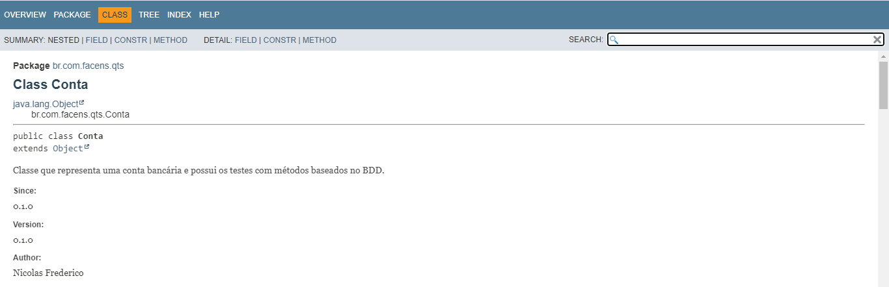

# BDD - Teste de Conta
Atividade de composição de nota para a AF da disciplina de Qualidade e Testes de Software. Análise e Desenvolvimento de Sistemas, 4o semestre - FACENS.

## Descrição do repositório
Este repositório guarda o código de uma aplicação de exemplo utilizada para fins de estudos de BDD (Behavior Driven Development). <br/>

A aplicação é composta por uma classe Conta que representa uma conta bancária. <br/>
O repositório utiliza a biblioteca Cucumber para escrever as especificações das features e seus respectivos métodos de teste.

Os testes BDD da aplicação podem ser rodados a partir de dois pontos de entrada:
1. Arquivo `arquivo_teste.feature`
2. Classe auxiliar `Runner`

Abaixo, seguem duas imagens do resultado dos testes de exemplo, sendo a primeira rodada a partir do arquivo `arquivo_teste.feature` e a segunda a partir do `Runner`:


Imagem de exemplo do JavaDoc gerado


## Como rodar
O projeto utiliza o Maven como gerenciador de dependências, portanto para rodar fora de uma IDE,
assegure que o maven está instalado na sua máquina e use os seguintes comandos:
```
mvn clean install
mvn test
```
Utilizando uma IDE como o IntellijIDEA, basta utilizar o runner do programa que tudo é feito automaticamente. Basta escolher rodar o arquivo `arquivo_teste.feature` ou a classe `Runner`.
<hr>
Última atualização 11/10/23
